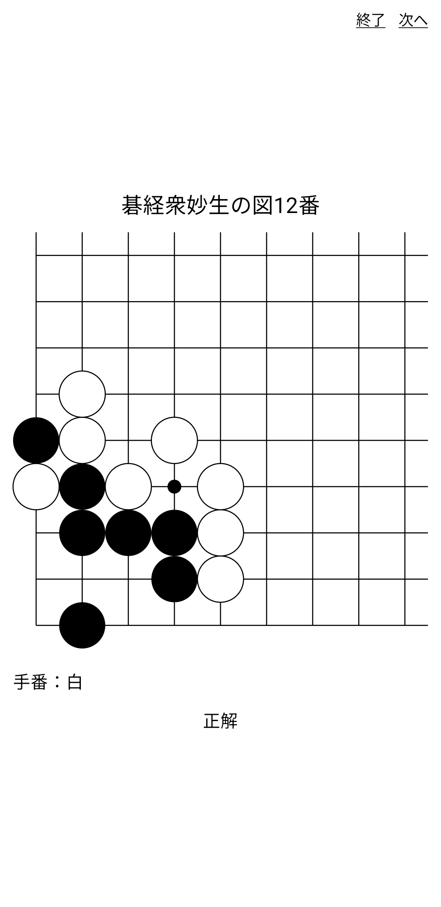

# Tsumegolet

<div align="center">

</div>

自分用の詰碁練習Androidアプリ

## Build

Android Studioは使い——ません。
CLI信者なのでね仕方ないね。

次をインストール:

- JDK
- Android Studio Commandline Tools
- proto
- Taskfile (not required)
- ktfmt (not required)

次を実行してセットアップ:

```sh
proto install

ANDROID_SDK_ROOT=<ANDROID_SDK_ROOT>
sdkmanager --sdk_root=$ANDROID_SDK_ROOT --licenses
sdkmanager --sdk_root=$ANDROID_SDK_ROOT "platform-tools" "platforms;android-35" "build-tools;35.0.0"

KEY_PASSWORD=<FAVORITE_KEY_PASSWORD>
KEY_ALIAS=<FAVORITE_KEY_ALIAS>
keytool -genkeypair -v -keystore release.jks -alias $KEY_ALIAS -keyalg RSA -keysize 2048 -validity 10000

echo "sdk.dir=$ANDROID_SDK_ROOT
RELEASE_STORE_FILE=$(pwd)/release.jks
RELEASE_KEY_ALIAS=$KEY_ALIAS
RELEASE_STORE_PASSWORD=$KEY_PASSWORD
RELEASE_KEY_PASSWORD=$KEY_PASSWORD
" > local.properties
```

ビルド:

```sh
task (debug|release)-build
```

> [!WARNING]
> `ANDROID_SDK_ROOT`はAndroid Studio Commandline Toolsのツールから見て`../../../`でなければならない。

## Emulate

エミュレータをインストール・仮想デバイスを作成:

```sh
EMULATOR_ARCH=(x86_64|arm64-v8a)
sdkmanager --sdk_root=$ANDROID_SDK_ROOT "emulator" "system-images;android-35;google_apis;$EMULATOR_ARCH"

VIRTUAL_DEVICE_NAME=<FAVORITE_NAME>
VIRTUAL_DEVICE_PROFILE_NAME=<CORRECT_NAME>
avdmanager create avd --name "$VIRTUAL_DEVICE_NAME" --package "system-images;android-35;google_apis;$EMULATOR_ARCH" --device "$VIRTUAL_DEVICE_PROFILE_NAME"
```

仮想デバイスを起動:

```sh
$ANDROID_SDK_ROOT/emulator/emulator -avd $VIRTUAL_DEVICE_NAME
```

実行:

```sh
task run
```
